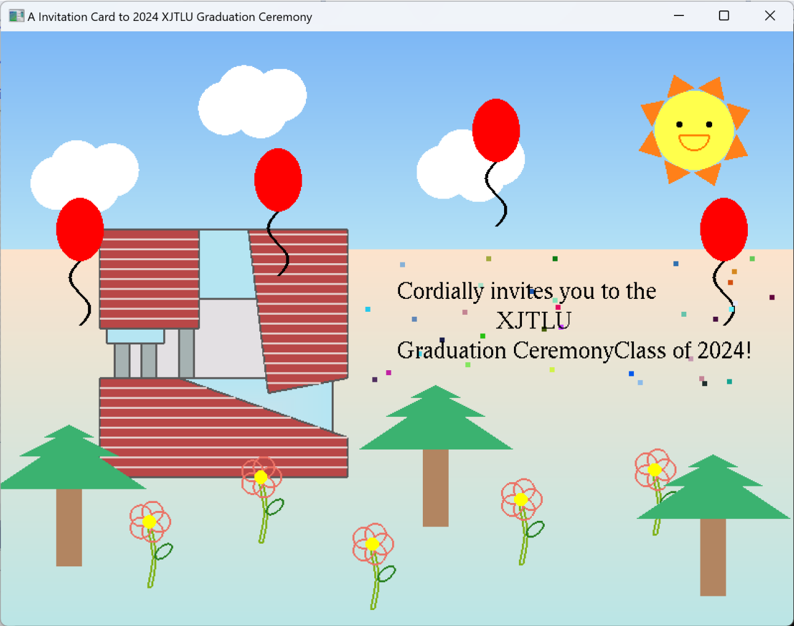

# Computer-Graphics
The Task
------
You are required to create a two-dimensional (2D) card of invitation to the 2024 XJTLU Graduation Ceremony, which should have some key features (e.g. a building on campus in a simplified shape) to represent the University. Your card may contain balloons, flowers, trees, smiling faces, lights, stars, clouds, sky, ground and other objects that may appear in a physical card of this kind. It should consist of both still and animated objects where appropriate. Keyboard and mouse interactions can be used to trigger the actions or display your card
in stages. An objective of the assignment is to make good use of the graphics techniques and OpenGL functions. In particular, you should consider the following in completing this assignment:
a) proper configuration and use of the MS VC++ and OpenGL environments as for the lab work, using only the freeglut library (other OpenGL libraries are not allowed for this assessment);
b) good visual effect of your card utilising the full range of the techniques covered to date in the module (e.g. creation of geometry, transformations, viewing, animation and interactions via the mouse and keyboard; no requirements to directly utilise geometric creation algorithms such as DDA or parametric curves/surfaces);
c) effective use of relevant OpenGL freeglut APIs;
d) good programming practice (e.g. necessary comments and neat format of coding).

Introduction
-------
Here is a two-dimensional (2D) card of invitation to the 2024 XJTLU Graduation Ceremony. In this card, there are sky, land, a sun, clouds, flowers, trees, some balloons,
Central Building, and invitation words with shining points.

The whole introduction and keyboard and mouse ineractions can be seen in the [report]("CPT205_written_report.pdf")
